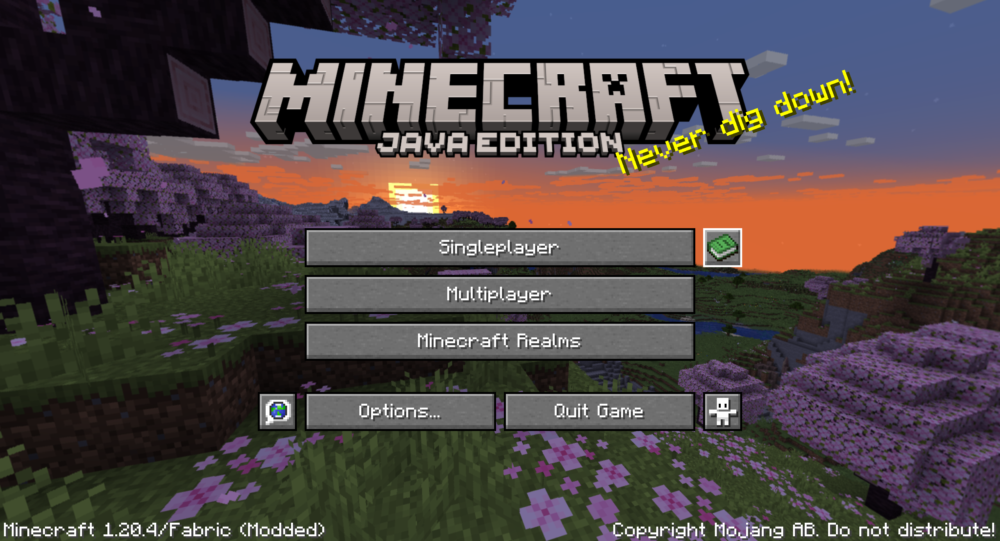
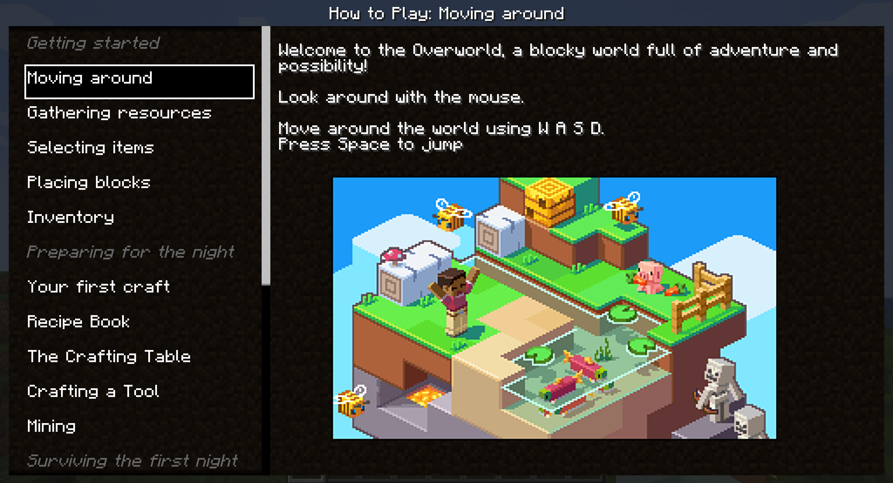
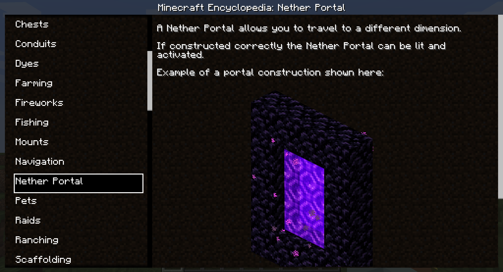
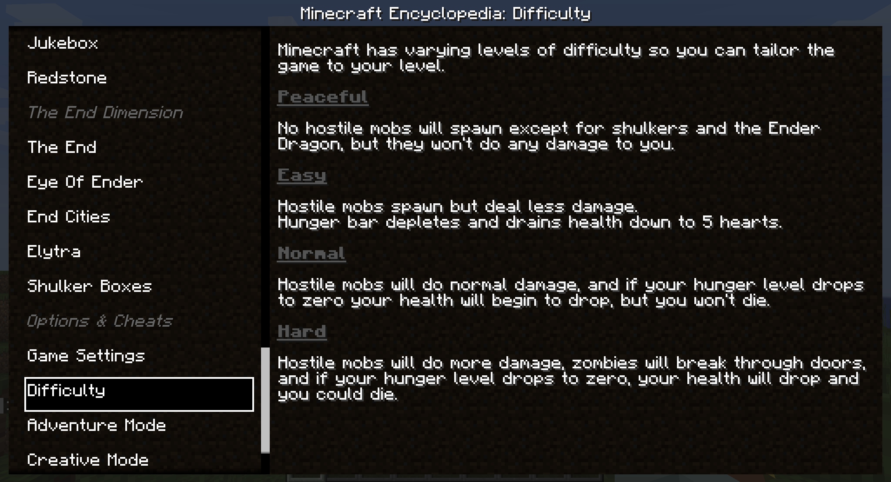
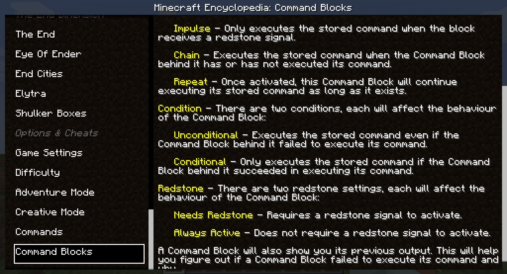

 

Minepedia is a client-side only Fabric mod that brings the Minecraft: Bedrock Edition "How to play" menu into Java Edition!

-------------------------

### 🤔 Is it the same as Bedrock Edition?

Some entries have been edited or removed to account the differences between Bedrock and Java edition. 

But, for the most part, you should get a one-to-one match between the two versions.

-------------------------

### 📖 How does it work?

-------------------------

You can access the Minepedia menu right from the main menu, using the newly added button right next to the Singleplayer button

or in-game using its own keybound (default to `K`)

Clicking on a voice on the left will change the displayed details on the right.

-------------------------

### 📜 Updates

Minepedia will get updated when the Bedrock Edition "How to play" menu gets updated with new major releases.

Right now every entry is "hardcoded" into the mod, but future projects include:

- Exposing some APIs or some ways to make other mods integrate inside the Minepedia menu
- Integrate the [Minecraft wiki](https://minecraft.wiki) to display info about blocks, items and more

-------------------------

### ⚙ Requirements

Minepedia is a client-side only mod, meaning that you can even use it while playing on your favorite server,
either vanilla ones or modded ones.

-------------------------

### 👨🏼‍💻 How to contribute

Anyone can contribute to Minepedia, suggesting their ideas [using the Feature Request module](https://github.com/JimiIT92/Minepedia/issues/new?assignees=JimiIT92&labels=enhancement&template=feature_request.md&title=)

The best part is that requests are not limited in any form.

If your idea makes it to the mod you'll also be mentioned in the mod's credits! 😁

-------------------------
### 🖥 Downloads

You can download Minepedia on [Modrinth](https://modrinth.com/mod/minepedia) or on [CurseForge](https://www.curseforge.com/minecraft/mc-mods/minepedia).

**I will post new releases only there**.

Any other websites that offers you Minepedia shouldn't be trusted and should be reported immediately (as they could be a scam and contain malicious software)!

-------------------------
### 🍺 Support the project

Developing and maintaining Minepedia, and its related websites, requires a lot of time and effort,
but after all I really enjoy doing this ❤

Minepedia is, and **<ins>always</ins>** will be, **<ins>FREE TO USE</ins>**.

If someone asked you some money to download Minepedia, I am afraid to tell you that you got scammed! 😥

But if you **really** want to financially support the project (or just buy me some beer to produce more code), these are the only ways:

&emsp;&emsp;&emsp;&emsp;&emsp;

Any other website asking you money for this project is a scam, and you should immediately report it to your local authorities as well! 😡

-------------------------
### 📜 Credits

- 🇮🇹 Italian language support added by [cranos96](https://github.com/cranos96)
- 🇺🇦 Ukrainian language support added by [StarmanMine142](https://github.com/StarmanMine142)
- 🇧🇷 Brazilian Portugues language support added by [seriousfreezing](https://github.com/seriousfreezing)

-------------------------
### 😁 Conclusion

Having an in-game guide that teaches you the game basics could be very handy for new players, but that is a Bedrock-exclusive feature for now.

So let's help our Java Edition friends by giving them the same guid! 😁

I hope you enjoy Minepedia as much as I enjoy develop new ideas and content for it,
and let me know if there are any issues on the [issue tracker](https://github.com/JimiIT92/Minepedia/issues/new?assignees=JimiIT92&labels=enhancement&template=bug_report.md&title=).

Have a nice day! 😁
